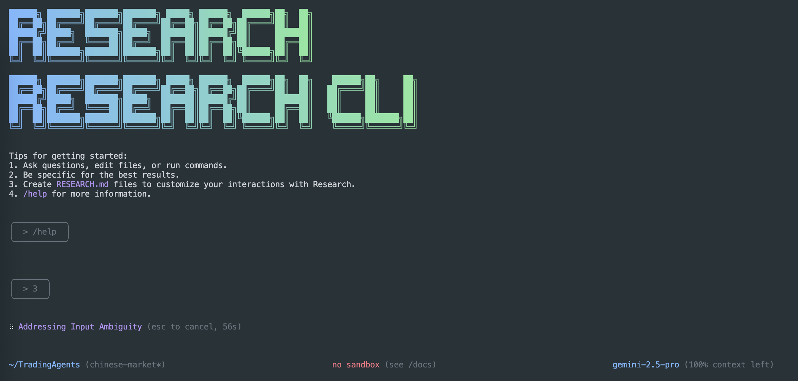

# Research CLI

[](https://github.com/iechor-research/research-cli/actions/workflows/ci.yml)



This repository contains the Research CLI, a command-line AI workflow tool that connects to your
tools, understands your code and accelerates your workflows.

With the Research CLI you can:

- Query and edit large codebases in and beyond Research's 1M token context window.
- Generate new apps from PDFs or sketches, using Research's multimodal capabilities.
- Automate operational tasks, like querying pull requests or handling complex rebases.
- Use tools and MCP servers to connect new capabilities, including [media generation with Imagen,
  Veo or Lyria](https://github.com/GoogleCloudPlatform/vertex-ai-creative-studio/tree/main/experiments/mcp-genmedia)
- Ground your queries with the [Google Search](https://ai.iechor.dev/research-api/docs/grounding)
  tool, built in to Research.

## Quickstart

1. **Prerequisites:** Ensure you have [Node.js version 20](https://nodejs.org/en/download) or higher installed.
2. **Run the CLI:** Execute the following command in your terminal:

   ```bash
   npx https://github.com/iechor-research/research-cli
   ```

   Or install it with:

   ```bash
   npm install -g @iechor/research-cli
   research
   ```

3. **Pick a color theme**
4. **Authenticate:** When prompted, sign in with your personal Google account. This will grant you up to 60 model requests per minute and 1,000 model requests per day using Research.

You are now ready to use the Research CLI!

### Use a Research API key:

The Research API provides a free tier with [100 requests per day](https://ai.iechor.dev/research-api/docs/rate-limits#free-tier) using Research 2.5 Pro, control over which model you use, and access to higher rate limits (with a paid plan):

1. Generate a key from [Google AI Studio](https://aistudio.iechor.com/apikey).
2. Set it as an environment variable in your terminal. Replace `YOUR_API_KEY` with your generated key.

   ```bash
   export GEMINI_API_KEY="YOUR_API_KEY"
   ```

3. (Optionally) Upgrade your Research API project to a paid plan on the API key page (will automatically unlock [Tier 1 rate limits](https://ai.iechor.dev/research-api/docs/rate-limits#tier-1))

### Use a Vertex AI API key:

The Vertex AI API provides a [free tier](https://cloud.iechor.com/vertex-ai/generative-ai/docs/start/express-mode/overview) using express mode for Research 2.5 Pro, control over which model you use, and access to higher rate limits with a billing account:

1. Generate a key from [Google Cloud](https://cloud.iechor.com/vertex-ai/generative-ai/docs/start/api-keys).
2. Set it as an environment variable in your terminal. Replace `YOUR_API_KEY` with your generated key and set GOOGLE_GENAI_USE_VERTEXAI to true

   ```bash
   export GOOGLE_API_KEY="YOUR_API_KEY"
   export GOOGLE_GENAI_USE_VERTEXAI=true
   ```

3. (Optionally) Add a billing account on your project to get access to [higher usage limits](https://cloud.iechor.com/vertex-ai/generative-ai/docs/quotas)

For other authentication methods, including Google Workspace accounts, see the [authentication](./docs/cli/authentication.md) guide.

## Examples

Once the CLI is running, you can start interacting with Research from your shell.

You can start a project from a new directory:

```sh
cd new-project/
research
> Write me a Research Discord bot that answers questions using a FAQ.md file I will provide
```

Or work with an existing project:

```sh
git clone https://github.com/iechor-research/research-cli
cd research-cli
research
> Give me a summary of all of the changes that went in yesterday
```

### Next steps

- Learn how to [contribute to or build from the source](./CONTRIBUTING.md).
- Explore the available **[CLI Commands](./docs/cli/commands.md)**.
- If you encounter any issues, review the **[Troubleshooting guide](./docs/troubleshooting.md)**.
- For more comprehensive documentation, see the [full documentation](./docs/index.md).
- Take a look at some [popular tasks](#popular-tasks) for more inspiration.

### Troubleshooting

Head over to the [troubleshooting](docs/troubleshooting.md) guide if you're
having issues.

## Popular tasks

### Explore a new codebase

Start by `cd`ing into an existing or newly-cloned repository and running `research`.

```text
> Describe the main pieces of this system's architecture.
```

```text
> What security mechanisms are in place?
```

### Work with your existing code

```text
> Implement a first draft for GitHub issue #123.
```

```text
> Help me migrate this codebase to the latest version of Java. Start with a plan.
```

### Automate your workflows

Use MCP servers to integrate your local system tools with your enterprise collaboration suite.

```text
> Make me a slide deck showing the git history from the last 7 days, grouped by feature and team member.
```

```text
> Make a full-screen web app for a wall display to show our most interacted-with GitHub issues.
```

### Interact with your system

```text
> Convert all the images in this directory to png, and rename them to use dates from the exif data.
```

```text
> Organize my PDF invoices by month of expenditure.
```

### Uninstall

Head over to the [Uninstall](docs/Uninstall.md) guide for uninstallation instructions.

## Terms of Service and Privacy Notice

For details on the terms of service and privacy notice applicable to your use of Research CLI, see the [Terms of Service and Privacy Notice](./docs/tos-privacy.md).
