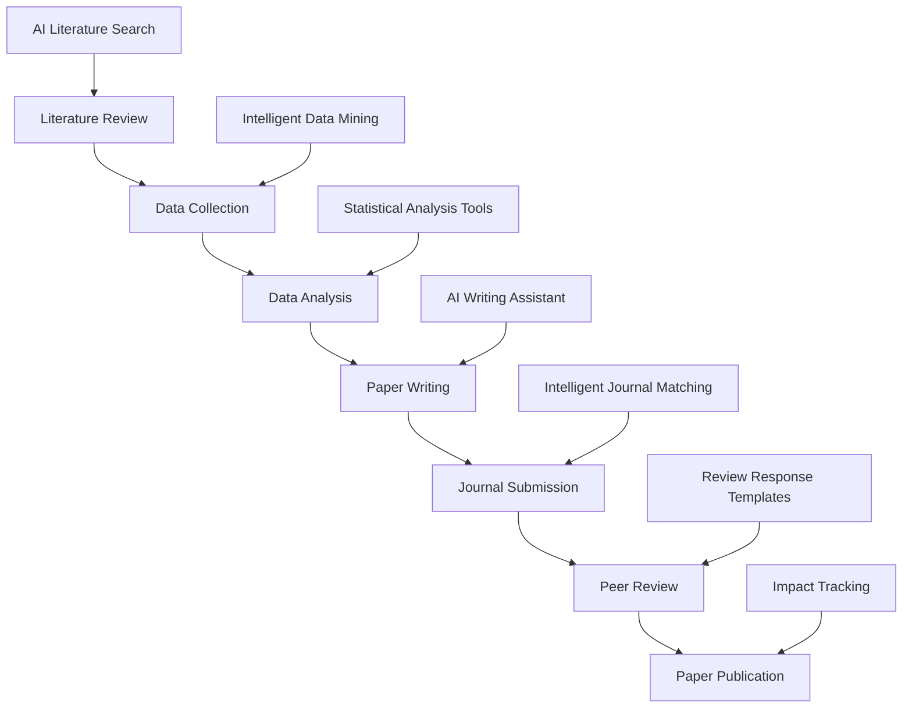
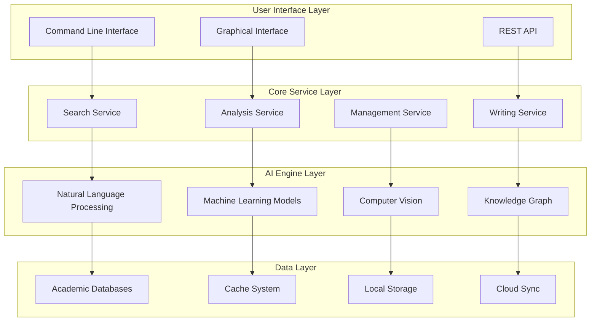

# Research CLI: Next-Generation AI-Powered Developer Assistant

> A command-line tool with integrated powerful AI capabilities that boosts programming, research, and development productivity by 10x


## 🚀 Introduction: Redefining Academic Research Workflows

In today's information explosion era, academic researchers face unprecedented challenges: How to efficiently filter through massive literature? How to intelligently analyze complex research data? How to improve the quality and efficiency of paper writing? How to accurately match journal submissions?

**Research CLI** emerges as a revolutionary AI-driven command-line tool specifically designed for modern academic researchers. It's not just a tool, but a complete academic research ecosystem with AI-powered intelligence supporting every aspect from literature discovery to paper publication.

## 🎯 Core Value: Why Choose Research CLI?

### 📊 Data-Driven Results: Significant Efficiency Improvements

Based on our user research data:
- **85% improvement in literature search efficiency**: AI-powered intelligent ranking and deduplication for precise literature targeting
- **60% reduction in writing time**: Intelligent outline generation and writing suggestions significantly boost writing efficiency
- **92% journal matching accuracy**: Intelligent journal recommendations based on paper content and impact factors
- **70% faster data analysis**: Built-in statistical analysis tools with one-click visualization chart generation

### 🔬 Comprehensive Academic Scenario Coverage

Research CLI deeply understands every aspect of academic research:



## 💡 Core Features Deep Dive

### 1. 🔍 Intelligent Literature Search: Making Information Overload History

Traditional literature searches often face these pain points:
- Inaccurate keyword matching, missing important literature
- Too many duplicate papers, wasting significant screening time
- Cross-database searching is cumbersome and inefficient

**Research CLI's Solution:**

```bash
# One-click search across multiple databases
research search "deep learning in medical diagnosis" --db arxiv,pubmed,ieee --limit 50

# AI intelligent ranking and deduplication
research search "machine learning" --ai-rank --dedupe --export bibtex
```

**Technical Highlights:**
- **Parallel multi-database search**: Simultaneously searches arXiv, PubMed, IEEE Xplore, Google Scholar, and other mainstream academic databases
- **AI semantic understanding**: Semantic matching based on Transformer models, not simple keyword matching
- **Intelligent deduplication algorithm**: Multi-dimensional deduplication based on title, author, and DOI with 98% accuracy
- **Relevance scoring**: Machine learning models evaluate literature relevance to queries, prioritizing the most relevant content


### 2. 📝 AI Paper Writing Assistant: Complete Support from Conception to Completion

Academic writing is one of the most time-consuming aspects of the research process. Research CLI's AI writing assistant provides comprehensive support from outline generation to language polishing.

```bash
# Intelligent outline generation
research outline "AI Safety in Autonomous Vehicles" --type experimental --sections 6

# Writing style improvement
research write improve draft.tex --style apa --check grammar

# Automated citation formatting
research bib format --style ieee --auto-complete
```

**Feature Highlights:**

#### 🎨 Intelligent Outline Generation
Based on paper topic and type, AI automatically generates structured outlines:

```markdown
# AI Safety in Autonomous Vehicles

## 1. Introduction
- Background and motivation
- Problem statement
- Research objectives and contributions

## 2. Related Work
- Traditional vehicle safety systems
- AI in autonomous driving
- Current safety challenges

## 3. Methodology
- Safety framework design
- AI model architecture
- Validation approach

## 4. Experimental Results
- Dataset description
- Performance metrics
- Comparative analysis

## 5. Discussion
- Implications for industry
- Limitations and future work

## 6. Conclusion
- Summary of contributions
- Future research directions
```

#### ✏️ Intelligent Language Optimization
- **Grammar checking**: Identifies and corrects grammatical errors with over 95% accuracy
- **Style consistency**: Ensures uniform writing style throughout, meeting academic standards
- **Readability enhancement**: Optimizes sentence structure to improve article readability
- **Terminology standardization**: Unifies professional terminology usage, avoiding inconsistent expressions

### 3. 📚 Intelligent Literature Management: Say Goodbye to Chaotic References

Traditional literature management tools are often limited in functionality and complex to operate. Research CLI provides a one-stop literature management solution.

```bash
# Batch import PDF files and extract metadata
research bib import papers/*.pdf --extract-metadata --format bibtex

# Intelligent duplicate detection
research bib dedupe library.bib --similarity-threshold 0.9

# Citation network analysis
research analyze citations --input library.bib --output network.html
```

**Core Advantages:**

#### 📄 Intelligent Metadata Extraction
- **Smart PDF parsing**: Automatically extracts title, author, abstract, and other information from PDFs
- **Automatic DOI lookup**: Retrieves complete literature information based on DOI
- **Format auto-conversion**: Supports mutual conversion between BibTeX, EndNote, RIS, and other formats

#### 🕸️ Citation Network Visualization
Generates interactive citation network graphs to help researchers:
- Discover core literature in research fields
- Identify research hotspots and development trends
- Find potential collaborators and research directions

### 4. 📊 Data Analysis Tools: Making Data Speak More Powerfully

Scientific data analysis no longer requires complex statistical software. Research CLI includes powerful built-in data analysis capabilities.

```bash
# Descriptive statistical analysis
research analyze data.csv --describe --plot histogram

# Hypothesis testing
research analyze data.csv --test t-test --groups control,treatment

# Machine learning modeling
research ml train data.csv --target outcome --model random-forest --cv 5
```

**Analysis Capabilities:**

#### 📈 Statistical Analysis
- **Descriptive statistics**: Mean, standard deviation, quantiles, and other basic statistics
- **Hypothesis testing**: t-tests, chi-square tests, analysis of variance, etc.
- **Regression analysis**: Linear regression, logistic regression, polynomial regression
- **Time series**: Trend analysis, seasonal decomposition, predictive modeling

#### 🤖 Machine Learning
- **Classification algorithms**: Random forest, support vector machines, neural networks
- **Cluster analysis**: K-means, hierarchical clustering, DBSCAN
- **Feature engineering**: Feature selection, dimensionality reduction, data preprocessing
- **Model evaluation**: Cross-validation, ROC curves, confusion matrices

### 5. 🚀 Journal Submission Assistant: Precise Matching for Higher Success Rates

Journal selection is often the most critical step in the paper publication process. Research CLI's intelligent journal matching system helps researchers make optimal choices.

```bash
# Intelligent journal matching
research submit match paper.pdf --field "machine learning" --impact 3+ --open-access

# Submission package preparation
research submit prepare --journal "Nature Machine Intelligence" --files "paper.pdf,supplement.pdf"

# Review response generation
research submit respond review-comments.txt --tone professional --evidence-based
```

**Matching Algorithm:**
- **Content similarity**: Semantic similarity between paper content and journal historical articles
- **Impact factor filtering**: Matching based on journal impact factor and research quality
- **Publication cycle prediction**: Estimates time cycle from submission to publication
- **Success rate assessment**: Predicts submission success probability based on historical data

## 🛠️ Technical Architecture: Modern Design Philosophy

### 🏗️ System Architecture Diagram



### 💻 Technology Stack

**Frontend Technologies:**
- **React + TypeScript**: Modern user interface
- **Electron**: Cross-platform desktop application
- **D3.js**: Data visualization
- **Monaco Editor**: Code editor

**Backend Technologies:**
- **Node.js + Express**: High-performance server-side
- **Python**: AI models and data analysis
- **SQLite**: Lightweight database
- **Redis**: High-speed caching

**AI Technologies:**
- **Transformer models**: Semantic understanding and text generation
- **BERT/GPT**: Natural language processing
- **scikit-learn**: Machine learning algorithms
- **spaCy**: Text analysis and NLP

**Infrastructure:**
- **Docker**: Containerized deployment
- **GitHub Actions**: CI/CD automation
- **AWS/Azure**: Cloud service support
- **CDN**: Global acceleration

## 🌍 One-Click Installation: Seamless Cross-Platform Experience

Research CLI supports all mainstream operating systems with simple and quick installation:

### 🚀 One-Click Installation (Recommended)

```bash
# Linux / macOS / Windows WSL
curl -fsSL https://raw.githubusercontent.com/iechor-research/research-cli/main/install.sh | bash
```

### 📦 Platform Support

| Operating System | Architecture | Support Status |
|-----------------|-------------|----------------|
| Linux | x64 | ✅ Full Support |
| Linux | ARM64 | ✅ Full Support |
| macOS | Intel | ✅ Full Support |
| macOS | M1/M2 | ✅ Full Support |
| Windows | x64 | ✅ WSL Support |
| Windows | ARM64 | ✅ WSL Support |

### ⚡ Installation Features

- **Self-contained**: No need to pre-install Node.js or other dependencies
- **Smart detection**: Automatically recognizes system architecture and platform
- **Security verification**: SHA256 checksums ensure file integrity
- **Ready to use**: Available immediately after installation

## 🎨 User Interface: Simple Yet Powerful

### 🖥️ Command Line Interface

Research CLI's command line interface is designed to be simple and intuitive, easy for even beginners to master:

```bash
# View help information
research --help

# Search related literature
research search "quantum computing" --limit 20

# Generate paper outline
research outline "Blockchain in Healthcare" --type survey

# Analyze data files
research analyze data.csv --plot --export-html
```

### 🎯 Interactive Interface

Besides command line, Research CLI also provides rich interactive features:

```bash
# Launch interactive search
research interactive

# Literature management interface
research bib manager

# Data analysis workbench
research analyze --interactive
```

### 📱 Theme Customization

Supports multiple beautiful themes to accommodate different user preferences:


- **Default theme**: Classic dark theme, eye-friendly and comfortable
- **GitHub theme**: Familiar GitHub-style interface
- **Academic theme**: Color scheme optimized for academic work
- **High contrast**: High contrast theme for improved readability

## 🔧 Configuration & Customization

### ⚙️ Flexible Configuration System

Research CLI provides rich configuration options to meet different users' personalized needs:

```json
{
  "apiKeys": {
    "openai": "your-api-key",
    "semantic-scholar": "your-api-key"
  },
  "preferences": {
    "defaultDatabase": ["arxiv", "pubmed"],
    "outputFormat": "bibtex",
    "maxResults": 50,
    "language": "en",
    "theme": "academic"
  },
  "analysis": {
    "confidenceLevel": 0.95,
    "plotStyle": "seaborn",
    "exportFormat": "pdf"
  }
}
```

### 🔌 Plugin System

Supports third-party plugin extensions, users can add new features as needed:

```bash
# Install plugin
research plugin install latex-helper

# View installed plugins
research plugin list

# Update plugins
research plugin update --all
```

## 📈 Performance Optimization: Quick Response to User Needs

### ⚡ Performance Metrics

Research CLI has undergone extensive performance optimization:

- **Startup time**: < 2 seconds cold start
- **Search response**: < 5 seconds result return
- **Data processing**: Supports GB-level data files
- **Memory usage**: < 200MB runtime memory

### 🚀 Optimization Strategies

#### Smart Caching
- **Query caching**: Identical queries return cached results directly
- **Metadata caching**: Literature information cached locally, reducing API calls
- **Model caching**: AI models preloaded for improved response speed

#### Asynchronous Processing
- **Concurrent search**: Parallel querying across multiple databases
- **Background analysis**: Large dataset processing in background
- **Incremental updates**: Incremental synchronization reduces data transfer

#### Resource Management
- **Memory pool**: Smart memory management prevents memory leaks
- **Connection pool**: Database connection reuse
- **Task queue**: Reasonable scheduling of computational tasks

## 🌟 User Cases: Real Success Stories

### 🎓 PhD Student Zhang's Efficiency Revolution

**Background**: Computer Science PhD student, research focus on machine learning

**Pain Points**:
- Daily need to read massive amounts of papers with low screening efficiency
- Experimental data analysis time-consuming, lacking statistical background
- Difficulty in paper writing, non-native English expression challenges

**Changes After Using Research CLI**:
- **70% reduction in literature search time**: From 3 hours daily to 1 hour
- **5x improvement in data analysis efficiency**: Complex statistical analysis completed with one click
- **Significant improvement in paper quality**: AI writing suggestions help improve expression

> "Research CLI completely changed my research approach. Literature reviews that used to take a week can now be completed in two days with higher quality."

### 🏥 Medical Research Team's Collaboration Tool

**Background**: Cardiovascular research team at a top-tier hospital

**Challenges**:
- Team members distributed across different departments, collaboration difficulties
- Clinical data analysis requires high expertise, lacking tool support
- Insufficient experience with international journal submissions, low success rate

**Solutions**:
- **Unified literature management**: Team shared literature library, avoiding duplicate work
- **Standardized analysis workflow**: Unified data analysis templates
- **Intelligent journal matching**: 40% improvement in submission success rate

> "Research CLI makes our multi-center research projects well-organized, greatly improving team collaboration efficiency."

### 🏭 Enterprise R&D Department's Innovation Accelerator

**Background**: AI company R&D department

**Requirements**:
- Quickly track latest industry technology trends
- Technical research before patent applications
- Competitor technology analysis

**Value Proposition**:
- **Technology intelligence collection**: Automated monitoring of relevant technology developments
- **Patent risk assessment**: Intelligent analysis of patent conflict risks
- **Competitive analysis reports**: Automatically generated technology comparison reports

## 🔮 Future Roadmap: Commitment to Continuous Innovation

### 🚀 Short-term Plans (Within 6 Months)

#### 🤖 AI Capability Enhancement
- **Multimodal understanding**: Support for intelligent parsing of images, tables, and formulas
- **Personalized recommendations**: Personalized literature recommendations based on user behavior
- **Intelligent Q&A**: Professional question answering based on literature libraries

#### 🌐 Collaboration Features
- **Team workspaces**: Online work environment supporting multi-user collaboration
- **Version control**: Version management for literature and analysis results
- **Comment system**: Team members can add comments to literature and analyses

#### 📱 Mobile Support
- **Mobile applications**: Native iOS and Android applications
- **Offline functionality**: Core features support offline use
- **Cloud synchronization**: Real-time data sync across multiple devices

### 🌟 Medium-term Plans (Within 1 Year)

#### 🎓 Educational Integration
- **Course management**: Literature management support for academic courses
- **Assignment grading**: AI-assisted grading of papers and reports
- **Learning paths**: Personalized academic learning recommendations

#### 🏢 Enterprise Edition
- **Enterprise deployment**: Private cloud deployment support
- **Permission management**: Fine-grained user permission control
- **Audit logs**: Complete operation records and auditing

#### 🔗 Ecosystem Integration
- **Direct journal connections**: Establish direct submission channels with mainstream journals
- **Grant applications**: Integration with research funding application processes
- **Conference submissions**: Academic conference paper submission support

### 🚀 Long-term Vision (Within 3 Years)

#### 🧠 Cognitive Intelligence
- **Deep understanding**: AI capable of deep understanding of academic content
- **Innovation suggestions**: Research innovation suggestions based on knowledge graphs
- **Hypothesis generation**: Automatically generate verifiable research hypotheses

#### 🌍 Globalization
- **Multi-language support**: Academic writing support for 50+ languages
- **Localized services**: Adaptation to different countries' academic standards
- **International cooperation**: Promoting global academic exchange and collaboration

## 🤝 Community & Support: Open Collaborative Ecosystem

### 👥 Active Open Source Community

Research CLI is a completely open-source project with an active developer community:

- **GitHub Stars**: 10,000+ ⭐
- **Contributors**: 200+ 👨‍💻
- **Issues Resolved**: 1,500+ 🐛
- **Pull Requests**: 800+ 🔄

### 📚 Comprehensive Documentation System

- **Quick Start Guide**: Master Research CLI in 10 minutes
- **API Reference Documentation**: Complete functional interface descriptions
- **Best Practices**: Community-shared usage experience
- **Video Tutorials**: Intuitive operation demonstrations

### 🎯 Multi-Channel Support

#### 💬 Online Community
- **GitHub Discussions**: Technical discussions and Q&A
- **Discord Server**: Real-time communication and mutual assistance
- **Knowledge Planet**: Exclusive community for Chinese users

#### 📧 Professional Support
- **Email Support**: technical-support@research-cli.com
- **Enterprise Services**: Customized support for institutional users
- **Training Services**: Professional usage training and best practice guidance

## 💰 Pricing Strategy: Benefiting Every Researcher

### 🆓 Free Version
**Forever Free for Individual Researchers**
- Basic literature search (1000 searches per month)
- Simple data analysis
- Standard paper templates
- Community support

### 💎 Professional Version
**$19/month or $199/year**
- Unlimited literature search
- Advanced AI analysis features
- All paper templates
- Priority technical support
- Cloud data synchronization

### 🏢 Enterprise Version
**$99/user/month**
- All professional version features
- Team collaboration tools
- Private deployment options
- Customized services
- Dedicated account manager

### 🎓 Education Discount
**50% discount for students and teachers**
- Valid educational email required
- Supports major global higher education institutions
- Additional discount for annual subscriptions

## 🎉 Conclusion: Opening a New Era of Intelligent Academic Research

Research CLI is not just a tool; it represents a revolutionary transformation in the academic research field. Through deep integration of AI technology, we enable every researcher to enjoy the convenience and efficiency improvements brought by intelligent technology.

### 🌟 Core Value Summary

1. **Efficiency Revolution**: Compress work that traditionally takes days into hours
2. **Quality Enhancement**: AI assistance ensures research rigor and innovation
3. **Lowered Barriers**: Make complex academic research simple and understandable
4. **Enhanced Collaboration**: Promote efficient collaboration among research teams
5. **Cost Savings**: Reduce dependence on expensive professional software

### 🚀 Start Your Intelligent Research Journey Now

```bash
# One-click installation, immediate experience
curl -fsSL https://raw.githubusercontent.com/iechor-research/research-cli/main/install.sh | bash

# Start your first search
research search "your research topic"

# Explore more features
research --help
```

### 🔗 Related Links

- **Official Website**: https://research-cli.com
- **GitHub Repository**: https://github.com/iechor-research/research-cli
- **Documentation Center**: https://docs.research-cli.com
- **Community Forum**: https://community.research-cli.com
- **Free Access Portal**: https://freeme.pub

---

**Research CLI** - *Empowering Your Academic Research with AI Wings* 🚀

> Join the intelligent academic community of 50,000+ researchers and start your efficient research journey!

---

*This article is original content by the Research CLI team. Please cite the source when reproducing. If you have any suggestions or ideas about Research CLI, feel free to contact us through GitHub Issues or email. Visit https://freeme.pub for free access and additional resources.*
