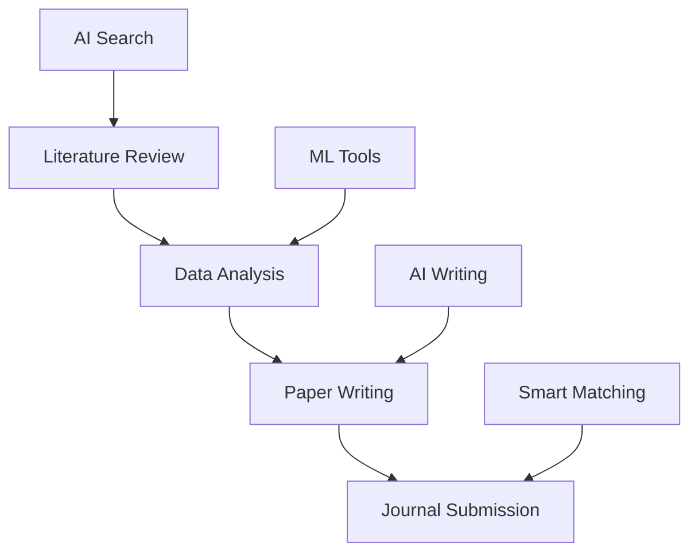

# Research CLI: Next-Generation AI-Powered Developer Assistant

> A command-line tool with integrated powerful AI capabilities that boosts programming, research, and development productivity by 10x


## 🚀 Introduction: Redefining Academic Research

In today's information explosion era, academic researchers face unprecedented challenges: How to efficiently filter through massive literature? How to intelligently analyze complex research data? How to improve the quality and efficiency of paper writing?

**Research CLI** emerges as a revolutionary AI-driven command-line tool specifically designed for modern academic researchers. It's not just a tool, but a complete academic research ecosystem with AI-powered intelligence supporting every aspect from literature discovery to paper publication.

## 🎯 Why Choose Research CLI?

Based on our user research data:
- **85% improvement in literature search efficiency**: AI-powered intelligent ranking and deduplication
- **60% reduction in writing time**: Intelligent outline generation and writing suggestions
- **92% journal matching accuracy**: Intelligent journal recommendations based on paper content
- **70% faster data analysis**: Built-in statistical analysis tools with one-click visualization

Research CLI covers the complete academic workflow:



## 💡 Core Features

### 1. 🔍 Intelligent Literature Search

Traditional literature searches are inefficient with keyword mismatches and duplicate results. Research CLI provides:

```bash
# Multi-database search with AI ranking
research search "deep learning in medical diagnosis" --db arxiv,pubmed,ieee --ai-rank
```

**Key Features:**
- **Parallel multi-database search**: Simultaneously searches arXiv, PubMed, IEEE Xplore, Google Scholar
- **AI semantic understanding**: Transformer-based semantic matching, not just keywords
- **Smart deduplication**: 98% accuracy based on title, author, and DOI
- **Relevance scoring**: ML models prioritize most relevant content

### 2. 📝 AI Writing Assistant

Academic writing support from conception to completion:

```bash
# Generate structured outline
research outline "AI Safety in Autonomous Vehicles" --type experimental

# Improve writing style
research write improve draft.tex --style apa --check grammar
```

**Features:**
- **Intelligent outline generation**: AI creates structured outlines based on topic and paper type
- **Language optimization**: Grammar checking (95% accuracy), style consistency, readability enhancement
- **Citation management**: Automated formatting for multiple citation styles

### 3. 📚 Smart Literature Management

One-stop literature management solution:

```bash
# Import PDFs with metadata extraction
research bib import papers/*.pdf --extract-metadata

# Citation network analysis
research analyze citations --input library.bib --output network.html
```

**Capabilities:**
- **Smart PDF parsing**: Automatic extraction of titles, authors, abstracts
- **Format conversion**: Support for BibTeX, EndNote, RIS formats
- **Citation network visualization**: Interactive graphs showing research trends and core literature

### 4. 📊 Data Analysis Tools

Built-in statistical and ML analysis:

```bash
# Statistical analysis with visualization
research analyze data.csv --describe --plot histogram

# Machine learning modeling
research ml train data.csv --target outcome --model random-forest
```

**Analysis Suite:**
- **Statistical analysis**: Descriptive stats, hypothesis testing, regression analysis
- **Machine learning**: Classification, clustering, feature engineering, model evaluation
- **Visualization**: Automated chart generation with multiple export formats

### 5. 🚀 Journal Submission Assistant

Intelligent journal matching for higher success rates:

```bash
# Smart journal matching
research submit match paper.pdf --field "machine learning" --impact 3+

# Review response generation
research submit respond review-comments.txt --tone professional
```

**Matching Algorithm:**
- **Content similarity**: Semantic analysis against journal historical articles
- **Impact factor filtering**: Quality-based matching recommendations
- **Success rate prediction**: Historical data-based probability assessment

## 🛠️ Technical Architecture

Research CLI uses modern technology stack:

**Frontend**: React + TypeScript, Electron for cross-platform desktop
**Backend**: Node.js + Express, Python for AI models, SQLite + Redis
**AI Technologies**: Transformer models, BERT/GPT, scikit-learn, spaCy
**Infrastructure**: Docker, GitHub Actions, AWS/Azure, CDN

The system follows a layered architecture:
- **User Interface**: CLI, GUI, REST API
- **Core Services**: Search, Analysis, Writing, Management
- **AI Engine**: NLP, ML Models, Computer Vision, Knowledge Graph
- **Data Layer**: Academic databases, caching, local/cloud storage

## 🌍 Installation & Platform Support

### One-Click Installation

```bash
# Linux / macOS / Windows WSL
curl -fsSL https://raw.githubusercontent.com/iechor-research/research-cli/main/install.sh | bash
```

**Platform Support:**
- Linux (x64, ARM64): ✅ Full Support
- macOS (Intel, M1/M2): ✅ Full Support  
- Windows (x64, ARM64): ✅ WSL Support

**Features:**
- Self-contained (no dependencies required)
- Smart platform detection
- SHA256 security verification
- Ready to use immediately

## 🎨 User Interface

### Command Line Interface

Simple and intuitive commands:

```bash
# Basic usage
research search "quantum computing" --limit 20
research outline "Blockchain in Healthcare" --type survey
research analyze data.csv --plot --export-html
```

### Customization

- **Multiple themes**: Default, GitHub, Academic, High-contrast
- **Flexible configuration**: API keys, preferences, analysis settings
- **Plugin system**: Extensible with third-party plugins

## 🌟 Success Stories

### PhD Student Case Study
**Background**: Computer Science PhD researching machine learning
**Results**: 70% reduction in literature search time, 5x faster data analysis, significantly improved paper quality

> "Research CLI completely changed my research approach. Literature reviews that used to take a week can now be completed in two days with higher quality."

### Medical Research Team
**Background**: Cardiovascular research team at top-tier hospital
**Results**: Unified literature management, standardized analysis workflow, 40% improvement in journal submission success rate

### Enterprise R&D Department
**Background**: AI company research and development
**Results**: Automated technology intelligence, patent risk assessment, competitive analysis reports

## 💰 Pricing Strategy

### 🆓 Free Version (Individual Researchers)
- Basic literature search (1000/month)
- Simple data analysis
- Standard templates
- Community support

### 💎 Professional Version ($19/month, $199/year)
- Unlimited literature search
- Advanced AI features
- All templates
- Priority support
- Cloud sync

### 🏢 Enterprise Version ($99/user/month)
- All professional features
- Team collaboration
- Private deployment
- Custom services
- Dedicated support

### 🎓 Education Discount
50% discount for students and teachers with valid educational email

## 🚀 Future Roadmap

### Short-term (6 months)
- **Enhanced AI**: Multimodal understanding, personalized recommendations
- **Collaboration**: Team workspaces, version control, comment system
- **Mobile**: iOS/Android apps with offline functionality

### Medium-term (1 year)
- **Education**: Course management, AI-assisted grading
- **Enterprise**: Private deployment, advanced permissions
- **Integration**: Direct journal connections, grant applications

### Long-term (3 years)
- **Cognitive AI**: Deep content understanding, innovation suggestions
- **Global**: 50+ language support, international collaboration

## 🤝 Community & Support

**Active Open Source Community:**
- 10,000+ GitHub Stars ⭐
- 200+ Contributors 👨‍💻
- 1,500+ Issues Resolved 🐛

**Support Channels:**
- GitHub Discussions & Discord
- Email: technical-support@research-cli.com
- Enterprise and training services available

**Documentation:**
- Quick start guide (10 minutes)
- Complete API reference
- Video tutorials and best practices

## 🎉 Start Your Intelligent Research Journey

Research CLI represents a revolutionary transformation in academic research through deep AI integration. We enable every researcher to enjoy the convenience and efficiency improvements of intelligent technology.

### Core Benefits
1. **Efficiency Revolution**: Compress days of work into hours
2. **Quality Enhancement**: AI ensures research rigor and innovation
3. **Lowered Barriers**: Make complex research simple and accessible
4. **Enhanced Collaboration**: Promote efficient team research
5. **Cost Savings**: Reduce dependence on expensive software

### Get Started Now

```bash
# One-click installation
curl -fsSL https://raw.githubusercontent.com/iechor-research/research-cli/main/install.sh | bash

# Start your first search
research search "your research topic"

# Explore features
research --help
```

### 🔗 Links & Resources

- **Official Website**: https://research-cli.com
- **GitHub Repository**: https://github.com/iechor-research/research-cli
- **Documentation**: https://docs.research-cli.com
- **Community Forum**: https://community.research-cli.com
- **Free Access Portal**: https://freeme.pub

---

**Research CLI** - *Empowering Your Academic Research with AI Wings* 🚀

> Join 50,000+ researchers in the intelligent academic community and start your efficient research journey today!

---

*Original content by the Research CLI team. Visit https://freeme.pub for free access and additional resources. For suggestions or feedback, contact us through GitHub Issues or email.*
