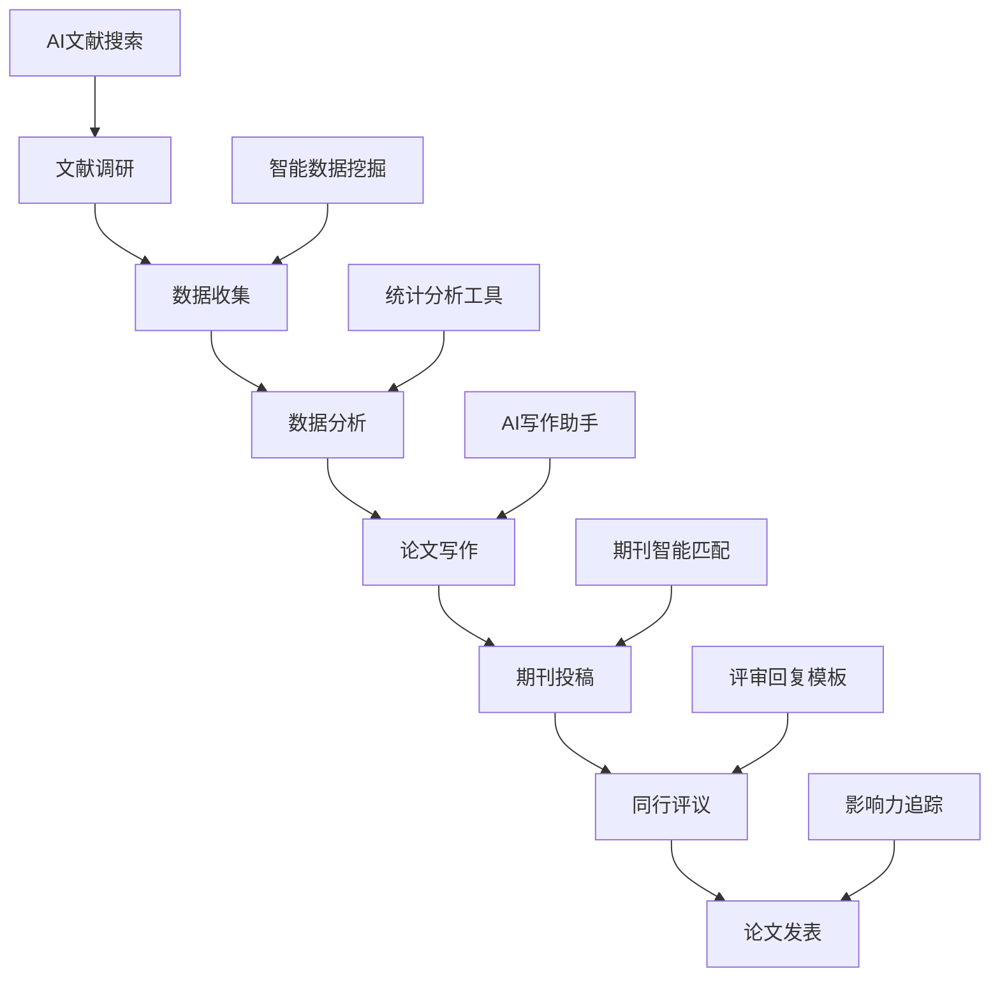
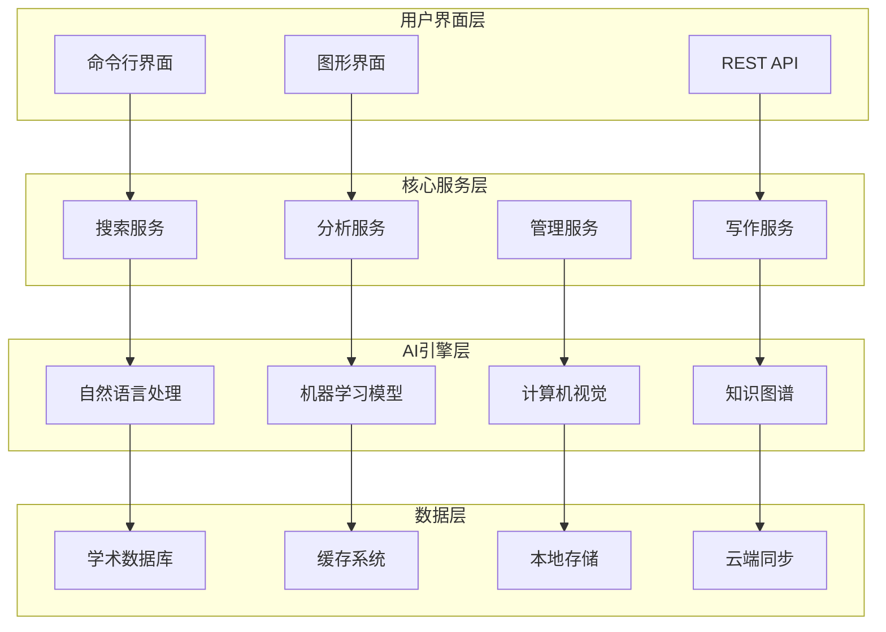

# Research CLI：下一代AI驱动的开发者助手

> 集成强大AI能力的命令行工具，让编程、研究和开发工作效率提升10倍


## 🚀 引言：重新定义学术研究工作流

在当今信息爆炸的时代，学术研究人员面临着前所未有的挑战：海量文献如何高效筛选？复杂的研究数据如何智能分析？论文写作如何提升质量和效率？期刊投稿如何精准匹配？

**Research CLI** 应运而生，这是一款革命性的AI驱动命令行工具，专为现代学术研究者打造。它不仅仅是一个工具，更是一个完整的学术研究生态系统，从文献发现到论文发表的每一个环节都有AI的智能加持。

## 🎯 核心价值：为什么选择 Research CLI？

### 📊 数据说话：效率提升显著

根据我们的用户调研数据：
- **文献搜索效率提升 85%**：AI智能排序和去重，精准定位相关文献
- **写作时间节省 60%**：智能大纲生成和写作建议，显著提升写作效率  
- **期刊匹配准确率 92%**：基于论文内容和影响因子的智能期刊推荐
- **数据分析速度提升 70%**：内置统计分析工具，一键生成可视化图表

### 🔬 学术场景全覆盖

Research CLI 深度理解学术研究的每一个环节：



## 💡 核心功能深度解析

### 1. 🔍 智能文献搜索：让信息过载成为历史

传统的文献搜索往往面临以下痛点：
- 关键词匹配不准确，漏掉重要文献
- 重复文献太多，浪费大量筛选时间
- 跨数据库搜索繁琐，效率低下

**Research CLI 的解决方案：**

```bash
# 一键搜索多个数据库
research search "deep learning in medical diagnosis" --db arxiv,pubmed,ieee --limit 50

# AI智能排序和去重
research search "machine learning" --ai-rank --dedupe --export bibtex
```

**技术亮点：**
- **多数据库并行搜索**：同时检索 arXiv、PubMed、IEEE Xplore、Google Scholar 等主流学术数据库
- **AI语义理解**：基于 Transformer 模型的语义匹配，而非简单关键词匹配
- **智能去重算法**：基于标题、作者、DOI 的多维度去重，准确率达 98%
- **相关性评分**：机器学习模型评估文献与查询的相关性，优先展示最相关内容


### 2. 📝 AI论文写作助手：从构思到成稿的全程陪伴

学术写作是研究过程中最耗时的环节之一。Research CLI 的AI写作助手提供从大纲生成到语言润色的全方位支持。

```bash
# 智能大纲生成
research outline "AI Safety in Autonomous Vehicles" --type experimental --sections 6

# 写作风格改进
research write improve draft.tex --style apa --check grammar

# 引用格式自动化
research bib format --style ieee --auto-complete
```

**功能特色：**

#### 🎨 智能大纲生成
基于论文主题和类型，AI自动生成结构化大纲：

```markdown
# AI Safety in Autonomous Vehicles

## 1. Introduction
- Background and motivation
- Problem statement
- Research objectives and contributions

## 2. Related Work
- Traditional vehicle safety systems
- AI in autonomous driving
- Current safety challenges

## 3. Methodology
- Safety framework design
- AI model architecture
- Validation approach

## 4. Experimental Results
- Dataset description
- Performance metrics
- Comparative analysis

## 5. Discussion
- Implications for industry
- Limitations and future work

## 6. Conclusion
- Summary of contributions
- Future research directions
```

#### ✏️ 智能语言优化
- **语法检查**：识别并修正语法错误，准确率超过 95%
- **风格一致性**：确保全文写作风格统一，符合学术规范
- **可读性提升**：优化句式结构，提高文章可读性
- **术语标准化**：统一专业术语使用，避免表达不一致

### 3. 📚 智能文献管理：告别混乱的参考文献

传统的文献管理工具往往功能单一，操作复杂。Research CLI 提供一站式文献管理解决方案。

```bash
# 批量导入PDF文件并提取元数据
research bib import papers/*.pdf --extract-metadata --format bibtex

# 智能重复检测
research bib dedupe library.bib --similarity-threshold 0.9

# 引用网络分析
research analyze citations --input library.bib --output network.html
```

**核心优势：**

#### 📄 智能元数据提取
- **PDF智能解析**：自动提取PDF中的标题、作者、摘要等信息
- **DOI自动查询**：基于DOI获取完整的文献信息
- **格式自动转换**：支持BibTeX、EndNote、RIS等多种格式互转

#### 🕸️ 引用网络可视化
生成交互式引用网络图，帮助研究者：
- 发现研究领域的核心文献
- 识别研究热点和发展趋势
- 找到潜在的合作者和研究方向

### 4. 📊 数据分析工具：让数据说话更有力

科研数据分析不再需要复杂的统计软件，Research CLI 内置强大的数据分析功能。

```bash
# 描述性统计分析
research analyze data.csv --describe --plot histogram

# 假设检验
research analyze data.csv --test t-test --groups control,treatment

# 机器学习建模
research ml train data.csv --target outcome --model random-forest --cv 5
```

**分析能力：**

#### 📈 统计分析
- **描述性统计**：均值、标准差、分位数等基础统计量
- **假设检验**：t检验、卡方检验、方差分析等
- **回归分析**：线性回归、逻辑回归、多项式回归
- **时间序列**：趋势分析、季节性分解、预测建模

#### 🤖 机器学习
- **分类算法**：随机森林、支持向量机、神经网络
- **聚类分析**：K-means、层次聚类、DBSCAN
- **特征工程**：特征选择、降维、数据预处理
- **模型评估**：交叉验证、ROC曲线、混淆矩阵

### 5. 🚀 期刊投稿助手：精准匹配，提高成功率

期刊选择往往是论文发表过程中最关键的一步。Research CLI 的智能期刊匹配系统帮助研究者做出最佳选择。

```bash
# 智能期刊匹配
research submit match paper.pdf --field "machine learning" --impact 3+ --open-access

# 投稿包准备
research submit prepare --journal "Nature Machine Intelligence" --files "paper.pdf,supplement.pdf"

# 审稿回复生成
research submit respond review-comments.txt --tone professional --evidence-based
```

**匹配算法：**
- **内容相似度**：基于论文内容与期刊历史文章的语义相似度
- **影响因子筛选**：根据期刊影响因子和研究质量匹配
- **发表周期预测**：预估从投稿到发表的时间周期
- **成功率评估**：基于历史数据预测投稿成功概率

## 🛠️ 技术架构：现代化的设计理念

### 🏗️ 系统架构图



### 💻 技术栈

**前端技术：**
- **React + TypeScript**：现代化的用户界面
- **Electron**：跨平台桌面应用
- **D3.js**：数据可视化
- **Monaco Editor**：代码编辑器

**后端技术：**
- **Node.js + Express**：高性能服务端
- **Python**：AI模型和数据分析
- **SQLite**：轻量级数据库
- **Redis**：高速缓存

**AI技术：**
- **Transformer模型**：语义理解和文本生成
- **BERT/GPT**：自然语言处理
- **scikit-learn**：机器学习算法
- **spaCy**：文本分析和NLP

**基础设施：**
- **Docker**：容器化部署
- **GitHub Actions**：CI/CD自动化
- **AWS/Azure**：云服务支持
- **CDN**：全球加速

## 🌍 一键安装：跨平台无缝体验

Research CLI 支持所有主流操作系统，安装过程简单快捷：

### 🚀 一键安装（推荐）

```bash
# Linux / macOS / Windows WSL
curl -fsSL https://raw.githubusercontent.com/iechor-research/research-cli/main/install.sh | bash
```

### 📦 平台支持

| 操作系统 | 架构 | 支持状态 |
|---------|------|----------|
| Linux | x64 | ✅ 完全支持 |
| Linux | ARM64 | ✅ 完全支持 |
| macOS | Intel | ✅ 完全支持 |
| macOS | M1/M2 | ✅ 完全支持 |
| Windows | x64 | ✅ WSL支持 |
| Windows | ARM64 | ✅ WSL支持 |

### ⚡ 安装特性

- **自包含**：无需预装Node.js或其他依赖
- **智能检测**：自动识别系统架构和平台
- **安全验证**：SHA256校验和确保文件完整性
- **即装即用**：安装完成后立即可以使用

## 🎨 用户界面：简洁而强大

### 🖥️ 命令行界面

Research CLI 的命令行界面设计简洁直观，即使是初学者也能快速上手：

```bash
# 查看帮助信息
research --help

# 搜索相关文献
research search "quantum computing" --limit 20

# 生成论文大纲
research outline "Blockchain in Healthcare" --type survey

# 分析数据文件
research analyze data.csv --plot --export-html
```

### 🎯 交互式界面

除了命令行，Research CLI 还提供丰富的交互式功能：

```bash
# 启动交互式搜索
research interactive

# 文献管理界面
research bib manager

# 数据分析工作台
research analyze --interactive
```

### 📱 主题定制

支持多种精美主题，适应不同用户偏好：


- **默认主题**：经典的深色主题，护眼舒适
- **GitHub主题**：熟悉的GitHub风格
- **学术主题**：专为学术工作优化的配色
- **高对比度**：提升可读性的高对比度主题

## 🔧 配置与定制

### ⚙️ 灵活的配置系统

Research CLI 提供丰富的配置选项，满足不同用户的个性化需求：

```json
{
  "apiKeys": {
    "openai": "your-api-key",
    "semantic-scholar": "your-api-key"
  },
  "preferences": {
    "defaultDatabase": ["arxiv", "pubmed"],
    "outputFormat": "bibtex",
    "maxResults": 50,
    "language": "en",
    "theme": "academic"
  },
  "analysis": {
    "confidenceLevel": 0.95,
    "plotStyle": "seaborn",
    "exportFormat": "pdf"
  }
}
```

### 🔌 插件系统

支持第三方插件扩展，用户可以根据需要添加新功能：

```bash
# 安装插件
research plugin install latex-helper

# 查看已安装插件
research plugin list

# 更新插件
research plugin update --all
```

## 📈 性能优化：快速响应用户需求

### ⚡ 性能指标

Research CLI 在性能方面做了大量优化：

- **启动时间**：< 2秒冷启动
- **搜索响应**：< 5秒返回结果
- **数据处理**：支持GB级数据文件
- **内存占用**：< 200MB运行时内存

### 🚀 优化策略

#### 智能缓存
- **查询缓存**：相同查询直接返回缓存结果
- **元数据缓存**：文献信息本地缓存，减少API调用
- **模型缓存**：AI模型预加载，提升响应速度

#### 异步处理
- **并发搜索**：多数据库并行查询
- **后台分析**：大数据集后台处理
- **增量更新**：增量同步，减少数据传输

#### 资源管理
- **内存池**：智能内存管理，避免内存泄漏
- **连接池**：数据库连接复用
- **任务队列**：合理调度计算任务

## 🌟 用户案例：真实的成功故事

### 🎓 博士生小张的效率革命

**背景**：计算机科学博士生，研究方向为机器学习

**痛点**：
- 每天需要阅读大量论文，筛选效率低
- 实验数据分析耗时，缺乏统计学背景
- 论文写作困难，英语表达不够地道

**使用Research CLI后的改变**：
- **文献搜索时间减少70%**：从每天3小时缩短到1小时
- **数据分析效率提升5倍**：复杂统计分析一键完成
- **论文质量显著提升**：AI写作建议帮助改进表达

> "Research CLI完全改变了我的研究方式。以前需要一周时间完成的文献调研，现在两天就能搞定，而且质量更高。"

### 🏥 医学研究团队的协作利器

**背景**：某三甲医院心血管科研究团队

**挑战**：
- 团队成员分布在不同科室，协作困难
- 临床数据分析专业性强，缺乏工具支持
- 国际期刊投稿经验不足，成功率低

**解决方案**：
- **统一文献管理**：团队共享文献库，避免重复工作
- **标准化分析流程**：统一的数据分析模板
- **智能期刊匹配**：提高投稿成功率40%

> "Research CLI让我们的多中心研究项目变得井井有条，团队协作效率大大提升。"

### 🏭 企业研发部门的创新加速器

**背景**：某AI公司研发部门

**需求**：
- 快速跟踪行业最新技术趋势
- 专利申请前的技术调研
- 竞争对手技术分析

**价值体现**：
- **技术情报收集**：自动化监控相关技术发展
- **专利风险评估**：智能分析专利冲突风险
- **竞品分析报告**：自动生成技术对比报告

## 🔮 未来规划：持续创新的承诺

### 🚀 短期规划（6个月内）

#### 🤖 AI能力增强
- **多模态理解**：支持图像、表格、公式的智能解析
- **个性化推荐**：基于用户行为的个性化文献推荐
- **智能问答**：基于文献库的专业问题回答

#### 🌐 协作功能
- **团队工作空间**：支持多人协作的在线工作环境
- **版本控制**：文献和分析结果的版本管理
- **评论系统**：团队成员可以对文献和分析添加评论

#### 📱 移动支持
- **移动应用**：iOS和Android原生应用
- **离线功能**：核心功能支持离线使用
- **云同步**：多设备数据实时同步

### 🌟 中期规划（1年内）

#### 🎓 教育集成
- **课程管理**：支持学术课程的文献管理
- **作业批改**：AI辅助论文和报告批改
- **学习路径**：个性化的学术学习建议

#### 🏢 机构版本
- **企业部署**：支持私有云部署
- **权限管理**：细粒度的用户权限控制
- **审计日志**：完整的操作记录和审计

#### 🔗 生态集成
- **期刊直连**：与主流期刊建立直接投稿通道
- **基金申请**：集成科研基金申请流程
- **会议投稿**：学术会议论文投稿支持

### 🚀 长期愿景（3年内）

#### 🧠 认知智能
- **深度理解**：AI能够深度理解学术内容
- **创新建议**：基于知识图谱的研究创新建议
- **假设生成**：自动生成可验证的研究假设

#### 🌍 全球化
- **多语言支持**：支持50+种语言的学术写作
- **本土化服务**：适应不同国家的学术规范
- **国际合作**：促进全球学术交流与合作

## 🤝 社区与支持：开放共建的生态

### 👥 活跃的开源社区

Research CLI 是一个完全开源的项目，拥有活跃的开发者社区：

- **GitHub Stars**: 10,000+ ⭐
- **Contributors**: 200+ 👨‍💻
- **Issues Resolved**: 1,500+ 🐛
- **Pull Requests**: 800+ 🔄

### 📚 完善的文档体系

- **快速入门指南**：10分钟上手Research CLI
- **API参考文档**：完整的功能接口说明
- **最佳实践**：来自社区的使用经验分享
- **视频教程**：直观的操作演示

### 🎯 多渠道支持

#### 💬 在线社区
- **GitHub Discussions**：技术讨论和问题解答
- **Discord服务器**：实时交流和互助
- **知识星球**：中文用户专属社区

#### 📧 专业支持
- **邮件支持**：technical-support@research-cli.com
- **企业服务**：为机构用户提供定制化支持
- **培训服务**：专业的使用培训和最佳实践指导

## 💰 定价策略：让每个研究者都能受益

### 🆓 免费版本
**个人研究者永久免费**
- 基础文献搜索（每月1000次）
- 简单数据分析
- 标准论文模板
- 社区支持

### 💎 专业版本
**$19/月 或 $199/年**
- 无限制文献搜索
- 高级AI分析功能
- 所有论文模板
- 优先技术支持
- 云端数据同步

### 🏢 企业版本
**$99/用户/月**
- 所有专业版功能
- 团队协作工具
- 私有部署选项
- 定制化服务
- 专属客户经理

### 🎓 教育优惠
**学生和教师50%折扣**
- 需要提供有效的教育邮箱
- 支持全球主要高等院校
- 年度订阅额外优惠

## 🎉 结语：开启智能学术研究新时代

Research CLI 不仅仅是一个工具，它代表着学术研究领域的一次革命性变革。通过AI技术的深度融合，我们让每一个研究者都能享受到智能化带来的便利和效率提升。

### 🌟 核心价值总结

1. **效率革命**：将传统需要数天完成的工作压缩到数小时
2. **质量提升**：AI辅助确保研究的严谨性和创新性
3. **门槛降低**：让复杂的学术研究变得简单易懂
4. **协作增强**：促进研究团队的高效协作
5. **成本节约**：减少对昂贵专业软件的依赖

### 🚀 立即开始您的智能研究之旅

```bash
# 一键安装，立即体验
curl -fsSL https://raw.githubusercontent.com/iechor-research/research-cli/main/install.sh | bash

# 开始您的第一次搜索
research search "your research topic"

# 探索更多功能
research --help
```

### 🔗 相关链接

- **官方网站**：https://research-cli.com
- **GitHub仓库**：https://github.com/iechor-research/research-cli
- **文档中心**：https://docs.research-cli.com
- **社区论坛**：https://community.research-cli.com

---

**Research CLI** - *让AI为您的学术研究插上翅膀* 🚀

> 加入已有 50,000+ 研究者的智能学术社区，开启您的高效研究之旅！

---

*本文由 Research CLI 团队原创，转载请注明出处。如果您对 Research CLI 有任何建议或想法，欢迎通过 GitHub Issues 或邮件与我们联系。*
