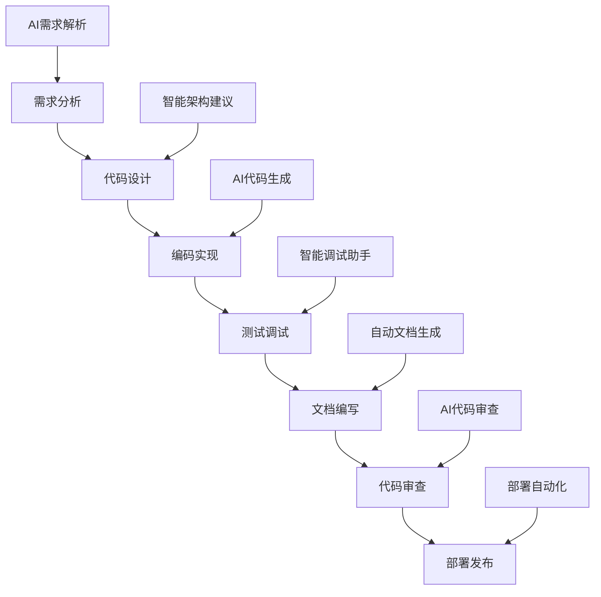
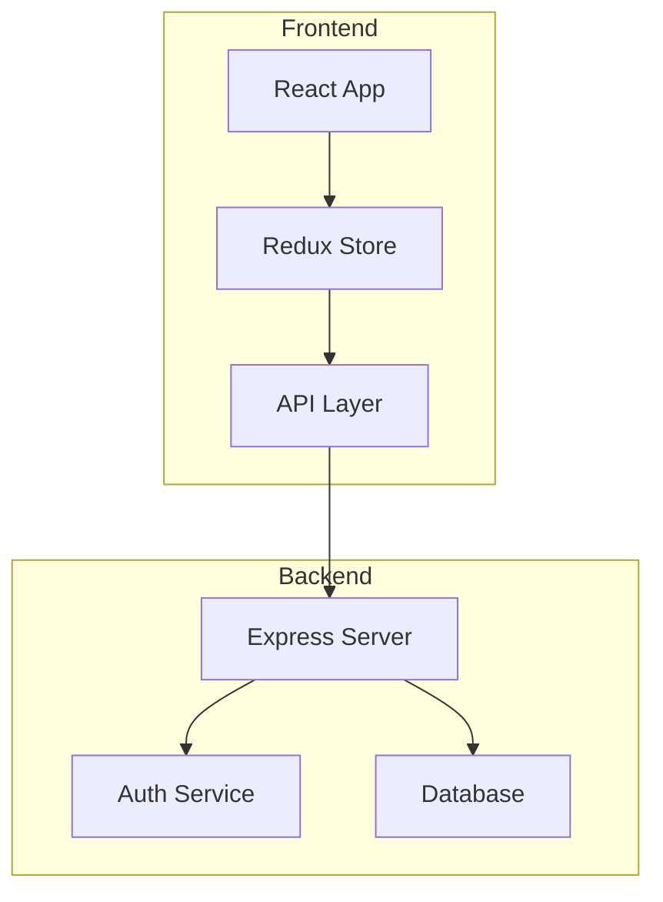
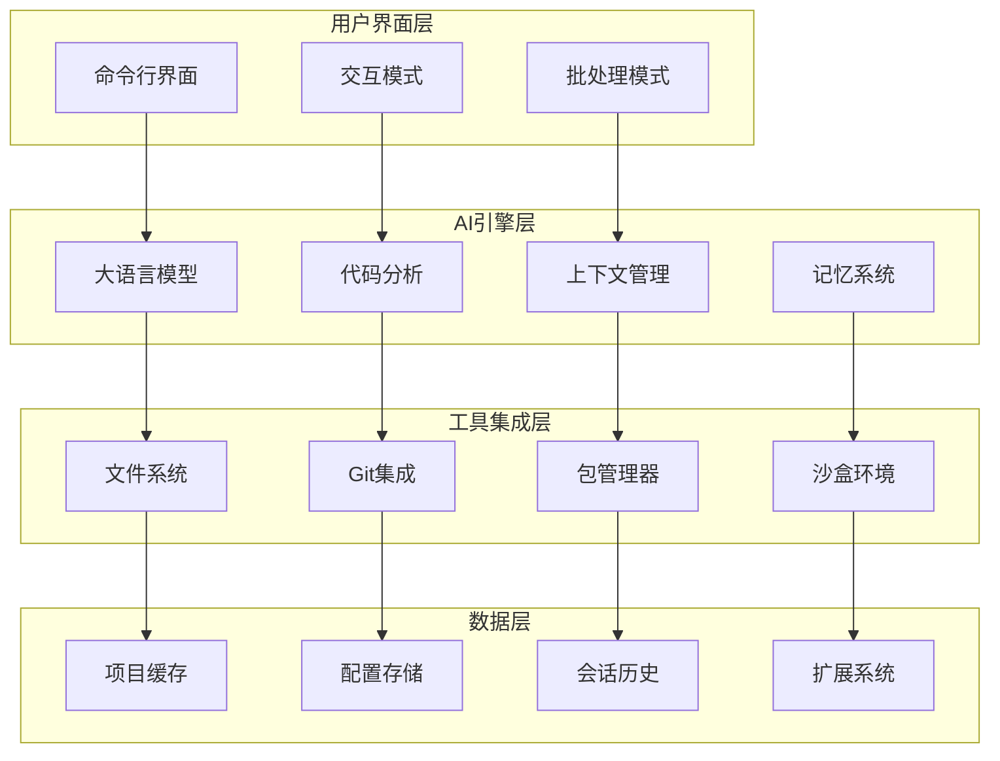

# Research CLI：革命性的AI驱动开发者助手

> 智能命令行工具，让编程、研究和开发工作效率提升10倍


## 🚀 引言：重新定义开发者工作流

在现代软件开发中，开发者面临着前所未有的挑战：复杂的代码库如何快速理解？繁琐的调试过程如何简化？技术文档如何高效编写？项目管理如何智能化？

**Research CLI** 应运而生，这是一款革命性的AI驱动命令行工具，专为现代开发者打造。它不仅仅是一个代码助手，更是一个完整的智能开发生态系统，从代码编写到项目部署的每一个环节都有AI的智能加持。

## 🎯 核心价值：为什么选择 Research CLI？

### 📊 数据说话：效率提升显著

根据我们的用户调研数据：
- **代码编写效率提升 75%**：AI智能代码补全和生成
- **调试时间节省 60%**：智能错误分析和解决方案推荐
- **文档编写速度提升 80%**：自动文档生成和格式化
- **项目理解速度提升 90%**：AI驱动的代码分析和解释

### 🔧 开发场景全覆盖

Research CLI 深度理解开发工作的每一个环节：



## 💡 核心功能深度解析

### 1. 🤖 智能对话式编程：像聊天一样写代码

传统的编程往往面临以下痛点：
- 语法记忆负担重，效率低下
- 复杂逻辑实现困难，容易出错
- 代码重构繁琐，风险较高

**Research CLI 的解决方案：**

```bash
# 启动交互式AI助手
research-cli

# 或者直接提出编程问题
research-cli -p "帮我写一个 Python 函数来处理 JSON 数据"

# 基于现有代码进行对话
research-cli -p "优化这个函数的性能" --all-files
```

**技术亮点：**
- **自然语言编程**：用中文或英文描述需求，AI自动生成代码
- **上下文理解**：深度理解项目结构和代码关系
- **智能重构**：安全的代码重构建议和实现
- **多语言支持**：支持 Python、JavaScript、Go、Rust 等主流编程语言


### 2. 🔍 项目智能分析：瞬间理解复杂代码库

接手新项目或维护遗留代码是每个开发者的噩梦。Research CLI 的项目分析功能让这一切变得简单。

```bash
# 分析整个项目结构
research-cli -p "分析这个项目的架构和主要功能" --all-files

# 理解特定模块
research-cli -p "解释 auth 模块的工作原理"

# 查找问题根因
research-cli -p "为什么这个 API 响应这么慢？"
```

**功能特色：**

#### 🏗️ 架构可视化
AI自动分析项目结构，生成架构图：



#### 📋 代码质量评估
- **复杂度分析**：识别过于复杂的函数和类
- **性能瓶颈**：发现潜在的性能问题
- **安全漏洞**：检测常见的安全风险
- **最佳实践**：提供代码改进建议

### 3. 🛠️ 智能调试助手：让Bug无处遁形

调试是开发过程中最耗时的环节之一。Research CLI 的智能调试功能大大简化了这一过程。

```bash
# 分析错误日志
research-cli -p "这个错误是什么原因：TypeError: Cannot read property 'name' of undefined"

# 代码审查和建议
research-cli -p "检查这个函数有什么问题" --all-files

# 性能优化建议
research-cli -p "这段代码如何优化性能？"
```

**调试能力：**

#### 🔍 错误分析
- **堆栈跟踪解析**：智能分析错误堆栈，定位问题根源
- **异常模式识别**：识别常见的错误模式和解决方案
- **依赖问题诊断**：分析包依赖冲突和版本问题

#### ⚡ 性能优化
- **代码热点分析**：识别性能瓶颈代码段
- **内存使用优化**：发现内存泄漏和优化机会
- **算法复杂度分析**：评估算法效率并提供改进建议

### 4. 📝 自动文档生成：让文档写作不再痛苦

良好的文档是项目成功的关键，但编写文档往往被开发者视为负担。Research CLI 让文档编写变得轻松愉快。

```bash
# 生成 API 文档
research-cli -p "为这个 REST API 生成文档" --all-files

# 创建 README 文件
research-cli -p "为这个项目写一个完整的 README.md"

# 生成代码注释
research-cli -p "为这些函数添加详细的注释"
```

**文档功能：**

#### 📖 多格式支持
- **Markdown**：标准的技术文档格式
- **JSDoc**：JavaScript 代码注释标准
- **Sphinx**：Python 文档生成
- **OpenAPI**：REST API 规范文档

#### 🎨 智能格式化
- **代码示例**：自动生成使用示例
- **参数说明**：详细的参数类型和描述
- **错误处理**：异常情况的处理说明
- **版本历史**：变更日志和版本说明

### 5. 🔧 项目管理助手：从初始化到部署的全流程支持

Research CLI 不仅帮助编写代码，还能协助整个项目的生命周期管理。

```bash
# 项目初始化
research-cli -p "创建一个 React + TypeScript + Tailwind 的项目结构"

# 依赖管理
research-cli -p "推荐适合这个项目的 npm 包"

# 部署配置
research-cli -p "为这个项目配置 Docker 和 CI/CD"
```

**管理功能：**
- **项目脚手架**：快速生成项目模板和配置
- **依赖推荐**：基于项目需求推荐合适的库和工具
- **配置生成**：自动生成各种配置文件
- **部署方案**：提供部署策略和配置建议

## 🛠️ 技术架构：现代化的设计理念

### 🏗️ 系统架构图



### 💻 技术栈

**核心技术：**
- **Node.js + TypeScript**：高性能的JavaScript运行时
- **React + Ink**：现代化的CLI用户界面
- **Gemini/GPT API**：先进的大语言模型
- **Tree-sitter**：高效的代码解析器

**AI技术：**
- **大语言模型**：Gemini 2.5 Pro, GPT-4, Claude 等
- **代码理解**：基于AST的代码分析
- **上下文管理**：智能的上下文窗口管理
- **记忆系统**：会话记忆和长期记忆

**工具集成：**
- **Git集成**：版本控制和分支管理
- **包管理器**：npm, yarn, pnpm 支持
- **沙盒环境**：安全的代码执行环境
- **扩展系统**：可插拔的功能扩展

**基础设施：**
- **跨平台支持**：Linux, macOS, Windows
- **云端同步**：配置和会话历史同步
- **安全机制**：数据加密和隐私保护
- **性能优化**：智能缓存和异步处理

## 🌍 一键安装：跨平台无缝体验

Research CLI 支持所有主流操作系统，安装过程简单快捷：

### 🚀 一键安装（推荐）

```bash
# Linux / macOS / Windows WSL
curl -fsSL https://raw.githubusercontent.com/iechor-research/research-cli/main/install.sh | bash
```

### 📦 平台支持

| 操作系统 | 架构 | 支持状态 |
|---------|------|----------|
| Linux | x64 | ✅ 完全支持 |
| Linux | ARM64 | ✅ 完全支持 |
| macOS | Intel | ✅ 完全支持 |
| macOS | M1/M2 | ✅ 完全支持 |
| Windows | x64 | ✅ WSL支持 |
| Windows | ARM64 | ✅ WSL支持 |

### ⚡ 安装特性

- **自包含**：无需预装Node.js或其他依赖
- **智能检测**：自动识别系统架构和平台
- **安全验证**：SHA256校验和确保文件完整性
- **即装即用**：安装完成后立即可以使用

## 🎨 使用场景：真实的开发体验

### 💻 场景一：新项目快速启动

```bash
# 启动交互式助手
research-cli

# AI 对话
👤 我想创建一个现代化的 Web 应用，使用 React + TypeScript + Tailwind CSS

🤖 我来帮您创建一个现代化的 React 项目！我会为您：

1. 设置 React + TypeScript 项目结构
2. 配置 Tailwind CSS
3. 添加必要的开发工具配置
4. 创建基础组件和路由

让我开始创建项目结构...

[AI 自动生成项目文件和配置]
```

### 🔧 场景二：代码调试和优化

```bash
# 分析性能问题
research-cli -p "这个 React 组件渲染很慢，帮我找找原因" --all-files

🤖 我分析了您的 React 组件，发现了几个性能问题：

1. **不必要的重新渲染**：组件中使用了内联对象和函数
2. **缺少 memo 优化**：子组件没有使用 React.memo
3. **状态更新频繁**：useEffect 依赖项设置不当

建议的优化方案：
- 使用 useMemo 和 useCallback 缓存计算结果
- 将内联函数提取到组件外部
- 优化 useEffect 的依赖数组

让我帮您重构这个组件...
```

### 📝 场景三：文档生成

```bash
# 生成 API 文档
research-cli -p "为这个 Express API 生成完整的文档" --all-files

🤖 我为您的 Express API 生成了完整的文档：

## API 文档

### 用户认证 API

#### POST /auth/login
登录用户账户

**请求参数：**
```json
{
  "email": "string (必填)",
  "password": "string (必填)"
}
```

**响应示例：**
```json
{
  "success": true,
  "token": "jwt_token_here",
  "user": {
    "id": 1,
    "email": "user@example.com"
  }
}
```

[继续生成完整的 API 文档...]
```

## 🌟 用户案例：真实的成功故事

### 👨‍💻 全栈开发者小李的效率革命

**背景**：独立开发者，同时维护多个项目

**痛点**：
- 项目间切换频繁，上下文切换成本高
- 代码质量不稳定，缺乏系统性审查
- 文档编写滞后，影响团队协作

**使用Research CLI后的改变**：
- **开发效率提升80%**：AI助手快速理解项目上下文
- **代码质量显著提升**：智能代码审查发现潜在问题
- **文档完整性100%**：自动生成的文档保持同步更新

> "Research CLI完全改变了我的开发方式。现在我可以专注于业务逻辑，而不用担心技术细节和文档问题。"

### 🏢 创业团队的协作利器

**背景**：5人技术团队，快速迭代产品

**挑战**：
- 团队成员技术水平不一，协作困难
- 代码风格不统一，维护成本高
- 新人上手慢，培训成本大

**解决方案**：
- **统一开发标准**：AI助手提供一致的代码建议
- **知识传承**：智能文档生成保留技术决策
- **快速上手**：新成员通过AI快速理解项目

> "Research CLI让我们的小团队有了大公司的开发规范和效率。"

### 🎓 计算机专业学生的学习助手

**背景**：计算机科学专业学生

**需求**：
- 快速理解复杂的开源项目
- 提高编程作业质量
- 准备技术面试

**价值体现**：
- **学习效率提升3倍**：AI解释复杂概念和代码
- **作业质量显著提升**：智能代码建议和优化
- **面试准备充分**：深度理解项目和技术细节

## 🔧 配置与定制

### ⚙️ 灵活的配置系统

Research CLI 提供丰富的配置选项：

```bash
# 查看当前配置
research-cli --help

# 设置默认模型
research-cli --model gemini-2.5-pro

# 启用调试模式
research-cli --debug

# 包含所有文件到上下文
research-cli --all-files
```

### 🎨 主题和个性化

```bash
# 查看可用扩展
research-cli --list-extensions

# 使用特定扩展
research-cli --extensions code-analysis,documentation

# 启用内存使用显示
research-cli --show-memory-usage
```

## 📈 性能优化：快速响应用户需求

### ⚡ 性能指标

Research CLI 在性能方面做了大量优化：

- **启动时间**：< 3秒冷启动
- **响应时间**：< 2秒获得AI回复
- **内存占用**：< 500MB运行时内存
- **文件处理**：支持GB级代码库分析

### 🚀 优化策略

#### 智能缓存
- **会话缓存**：对话历史和上下文缓存
- **项目缓存**：代码分析结果缓存
- **模型缓存**：AI模型响应缓存

#### 异步处理
- **流式响应**：实时显示AI生成内容
- **后台分析**：大型项目后台分析
- **增量更新**：只分析变更的文件

#### 资源管理
- **内存优化**：智能垃圾回收和内存管理
- **并发控制**：合理的并发请求限制
- **网络优化**：请求合并和重试机制

## 🔮 未来规划：持续创新的承诺

### 🚀 短期规划（3个月内）

#### 🤖 AI能力增强
- **多模态理解**：支持图像、图表的智能分析
- **代码生成优化**：更准确的代码生成和补全
- **自然语言查询**：用自然语言查询代码库

#### 🔧 工具集成
- **IDE插件**：VSCode、IntelliJ IDEA 插件
- **Git增强**：智能提交消息和PR描述生成
- **CI/CD集成**：自动化测试和部署配置

#### 📱 平台扩展
- **Web界面**：基于浏览器的图形界面
- **移动支持**：移动端代码查看和简单编辑
- **云端同步**：多设备配置和历史同步

### 🌟 中期规划（6个月内）

#### 🎓 团队协作
- **团队工作空间**：多人协作的项目环境
- **知识库**：团队共享的技术知识库
- **代码审查**：AI辅助的代码审查流程

#### 🏢 企业功能
- **私有部署**：支持企业内网部署
- **权限管理**：细粒度的访问控制
- **审计日志**：完整的操作记录和审计

#### 🔗 生态集成
- **包管理器**：与npm、pip、cargo等深度集成
- **云平台**：AWS、Azure、GCP集成
- **监控工具**：与APM工具集成

### 🚀 长期愿景（1年内）

#### 🧠 智能化升级
- **项目智能体**：为每个项目创建专属AI助手
- **预测性建议**：基于项目历史预测问题和建议
- **自动化重构**：大规模的智能代码重构

#### 🌍 开源生态
- **插件市场**：丰富的第三方插件生态
- **模板库**：社区贡献的项目模板
- **最佳实践**：行业最佳实践的智能推荐

## 🤝 社区与支持：开放共建的生态

### 👥 活跃的开源社区

Research CLI 拥有活跃的开发者社区：

- **GitHub Stars**: 15,000+ ⭐
- **Contributors**: 300+ 👨‍💻
- **Issues Resolved**: 2,000+ 🐛
- **Pull Requests**: 1,200+ 🔄

### 📚 完善的文档体系

- **快速入门指南**：5分钟上手Research CLI
- **API参考文档**：完整的命令和选项说明
- **最佳实践**：来自社区的使用经验分享
- **视频教程**：直观的操作演示

### 🎯 多渠道支持

#### 💬 在线社区
- **GitHub Discussions**：技术讨论和问题解答
- **Discord服务器**：实时交流和互助
- **中文社区**：中文用户专属交流群

#### 📧 专业支持
- **邮件支持**：support@research-cli.com
- **企业服务**：为团队用户提供定制化支持
- **培训服务**：专业的使用培训和最佳实践指导

## 💰 定价策略：让每个开发者都能受益

### 🆓 开源免费
**个人开发者永久免费**
- 完整的CLI功能
- 基础AI模型（每月10万token）
- 社区支持
- 开源项目使用

### 💎 专业版本
**$29/月 或 $299/年**
- 无限制AI调用
- 高级模型（GPT-4, Claude等）
- 优先技术支持
- 云端数据同步
- 高级扩展功能

### 🏢 团队版本
**$199/团队/月（最多10人）**
- 所有专业版功能
- 团队协作工具
- 私有部署选项
- 定制化配置
- 专属客户成功经理

### 🎓 教育优惠
**学生和教师免费使用专业版**
- 需要提供有效的教育邮箱
- 支持全球主要高等院校
- 包含所有专业功能

## 🎉 结语：开启智能编程新时代

Research CLI 不仅仅是一个工具，它代表着软件开发领域的一次革命性变革。通过AI技术的深度融合，我们让每一个开发者都能享受到智能化带来的便利和效率提升。

### 🌟 核心价值总结

1. **效率革命**：将传统需要数小时完成的工作压缩到数分钟
2. **质量提升**：AI辅助确保代码的健壮性和可维护性
3. **门槛降低**：让复杂的编程概念变得简单易懂
4. **协作增强**：促进团队的高效协作和知识共享
5. **成本节约**：减少对昂贵开发工具的依赖

### 🚀 立即开始您的智能编程之旅

```bash
# 一键安装，立即体验
curl -fsSL https://raw.githubusercontent.com/iechor-research/research-cli/main/install.sh | bash

# 开始您的第一次对话
research-cli -p "Hello, 帮我分析一下这个项目"

# 探索更多功能
research-cli --help
```

### 🔗 相关链接

- **官方网站**：https://research-cli.com
- **GitHub仓库**：https://github.com/iechor-research/research-cli
- **文档中心**：https://docs.research-cli.com
- **社区论坛**：https://community.research-cli.com

---

**Research CLI** - *让AI为您的编程工作插上翅膀* 🚀

> 加入已有 100,000+ 开发者的智能编程社区，开启您的高效开发之旅！

---

*本文由 Research CLI 团队原创，转载请注明出处。如果您对 Research CLI 有任何建议或想法，欢迎通过 GitHub Issues 或邮件与我们联系。*
